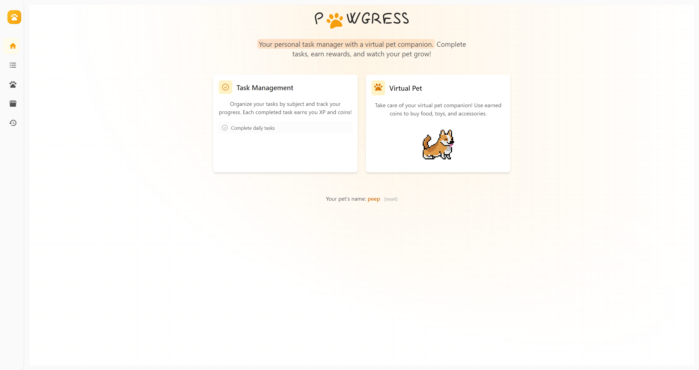
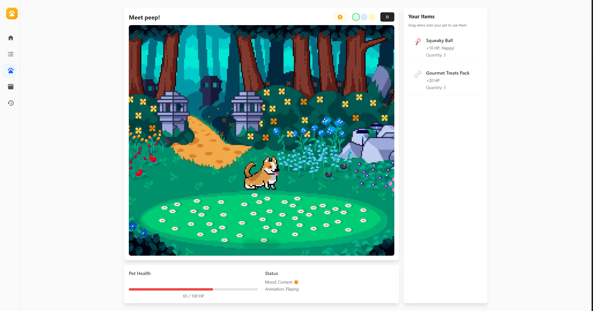

# Pawgress

Pawgress combines task management with the charm of a virtual pet to help users stay productive while enjoying a delightful companion.

## Motivation

Pawgress was inspired by our love for animals and our desire to boost productivity. We wanted to create a unique tool that empowers users to efficiently manage their tasks while enjoying the companionship of a digital pet.

## Features

- Manage your tasks with ease using an intuitive task management system.
- Stay motivated with a delightful virtual pet that grows and interacts with you as you complete tasks.
- A clean, responsive interface designed to make task management enjoyable.

## How It Works

Pawgress motivates users to stay on track by tying task completion to the well-being and interaction of a digital pet. Complete your tasks to keep your pet happy and unlock additional features.

## How We Built It

### Frontend

- **React**: Leveraged for its efficient component-based architecture and robust state management.
- **Tailwind CSS**: Used as a utility-first CSS framework for streamlined styling and responsive design.
- **Vite**: Chosen for its fast bundling and hot module replacement, which enhanced the development experience.

### Backend

- **SQLite**: Used as the database for its simplicity and ease of setup during development.
- **CRUD Operations**: Implemented to allow users to Create, Read, Update, and Delete tasks seamlessly.
- **API Integration**: Established communication between the Frontend and Backend via API calls.

## Challenges We Faced

- Initial UI issues where multiple elements failed to respond correctly to user interactions.
- Iterative debugging and design improvements were required to achieve a smooth and intuitive user experience.

## Accomplishments We're Proud Of

- The **'Your Pet' screen**: A beautifully designed and complete interface that captures the essence of Pawgress.
- Successfully integrating gamification principles to make productivity fun and engaging.

## Closing Thoughts

Pawgress is more than just a productivity tool; it’s a delightful companion that transforms task management into an enjoyable experience. By integrating gamification with task t
